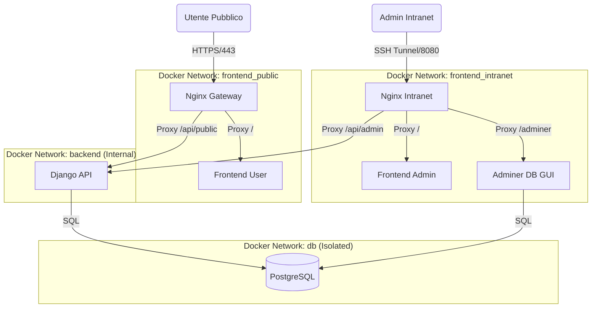

# Architettura del Sistema

## Panoramica
Il progetto "My-Wedding-App" è un'applicazione web moderna basata su microservizi, progettata per gestire inviti di matrimonio, conferme (RSVP) e analytics. L'infrastruttura è completamente dockerizzata per garantire portabilità, isolamento e scalabilità.

## Diagramma dei Componenti

## Servizi Core

### 1. Gateway (Nginx)
Il sistema utilizza due istanze Nginx distinte per separare fisicamente il traffico pubblico da quello amministrativo:
- **nginx-public**: Gestisce il traffico internet in ingresso. Serve il Frontend User (React) e proxa le chiamate API pubbliche (`/api/public/`) al backend.
- **nginx-intranet**: Gestisce il traffico interno (bind su `127.0.0.1`). Serve il Frontend Admin (React), Adminer e le API amministrative (`/api/admin/`).

### 2. Backend (Django)
Il cuore logico dell'applicazione. Espone due set di API distinti:
- **Public API**: Endpoint read-only o limited-write (es. RSVP) protetti da token HMAC o sessioni temporanee.
- **Admin API**: Endpoint completi per la gestione inviti, accessibili solo dalla rete Intranet.

### 3. Frontend (React + Vite)
Due Single Page Application (SPA) separate:
- **User App**: Focalizzata su UX/UI emozionale (`framer-motion`), mobile-first.
- **Admin App**: Dashboard gestionale (`tailwindcss`, `recharts`) per monitorare statistiche e inviti.

### 4. Database (PostgreSQL)
Il database è isolato in una rete Docker dedicata (`db_network`) e non è mai esposto direttamente, nemmeno agli altri container frontend. Solo `backend` e `adminer` possono comunicare con esso.

## Sicurezza di Rete
L'architettura implementa una "Defense in Depth":
1.  **Isolamento Reti**: Frontend User non può vedere Frontend Admin o il DB.
2.  **Internal Networks**: Le reti `backend` e `db` hanno il flag `internal: true`, impedendo l'accesso diretto a Internet (outbound) se non esplicitamente configurato.
3.  **Binding Locale**: I servizi amministrativi sono bindati su localhost, richiedendo un tunnel SSH per l'accesso remoto.
