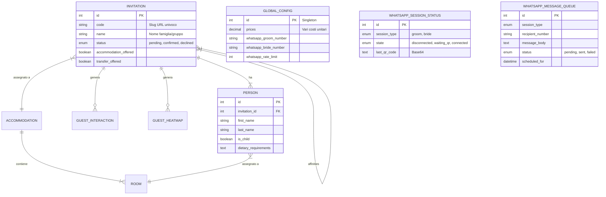

# Struttura del Database

Il progetto utilizza PostgreSQL come RDBMS principale. Lo schema è progettato per gestire in modo efficiente le relazioni tra inviti (gruppi) e ospiti (singoli), tracciando al contempo le interazioni per fini statistici.

## Entity Relationship Diagram (ERD)

## Descrizione Modelli Core

### 1. Invitation (Partecipazione)
L'entità radice del sistema. Ogni invito è identificato univocamente da un codice (`code`) che viene utilizzato nell'URL pubblico.
- **Logica**: Un invito raggruppa più persone.
- **RSVP**: Contiene lo stato complessivo della risposta (`status`).

### 2. Person (Ospite)
Rappresenta il singolo invitato. Distingue tra adulti e bambini (`is_child`) per calcoli logistici.

### 3. GlobalConfig (Singleton)
Contiene le configurazioni globali dell'applicazione, modificabili a runtime dall'admin:
- **Prezzi**: Costi unitari per budget tracker.
- **Testi**: Template per le lettere.
- **WhatsApp**: Numeri di telefono sposi, rate limit orario e flag simulazione typing.

## Modelli Analytics
- **GuestInteraction**: Traccia eventi discreti (click, visite, rsvp).
- **GuestHeatmap**: Salva i movimenti del mouse aggregati per sessione.

## Modelli WhatsApp Integration
Modelli dedicati alla gestione della messaggistica asincrona per evitare blocchi:

### 4. WhatsAppSessionStatus
Mantiene lo stato corrente della connessione con i container WAHA.
- **Scopo**: Permette al frontend admin di sapere se è necessario mostrare il QR code senza interrogare direttamente i container (che sono su rete interna).

### 5. WhatsAppMessageQueue
Coda di persistenza per i messaggi in uscita.
- **Logica**: I messaggi non vengono inviati subito. Un worker processa questa tabella cronologicamente.
- **Rate Limiting**: Il worker controlla quante entry in stato `SENT` esistono nell'ultima ora prima di evadere nuovi messaggi `PENDING`.
