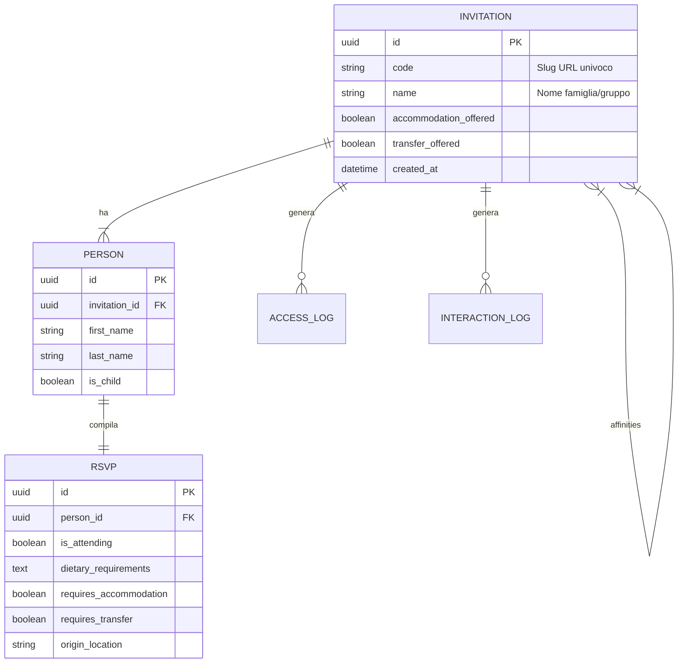

# Struttura del Database

Il progetto utilizza PostgreSQL come RDBMS principale. Lo schema è progettato per gestire in modo efficiente le relazioni tra inviti (gruppi) e ospiti (singoli), tracciando al contempo le interazioni per fini statistici.

## Entity Relationship Diagram (ERD)

## Descrizione Modelli Core

### 1. Invitation (Partecipazione)
L'entità radice del sistema. Ogni invito è identificato univocamente da un codice (`code`) che viene utilizzato nell'URL pubblico (es. `miomatrimonio.com/famiglia-rossi`).
- **Logica**: Un invito raggruppa più persone (es. marito, moglie, figli).
- **Opzioni**: I flag `accommodation_offered` e `transfer_offered` determinano se il frontend mostrerà le relative opzioni nel form RSVP per i membri di questo gruppo.

### 2. Person (Ospite)
Rappresenta il singolo invitato.
- **Dettagli**: Distingue tra adulti e bambini (`is_child`) per calcoli logistici (es. menu bambini, seggioloni).

### 3. RSVP (Conferma)
Contiene i dati dinamici compilati dall'utente.
- **Relazione**: È 1:1 con `Person`.
- **Visibilità Campi**: I campi `requires_accommodation` e `requires_transfer` sono visibili/modificabili solo se l'invito padre ha i relativi flag abilitati.

## Modelli Analytics

### 4. AccessLog
Registro di audit per ogni visualizzazione della pagina invito.
- **Utilizzo**: Calcolo del tasso di apertura delle partecipazioni digitali.
- **Privacy**: Registra User-Agent e IP anonimizzato (se configurato).

### 5. InteractionLog
Tabella ad alto volume per heatmaps e UX analysis.
- **Eventi tracciati**: Click, Scroll depth, Mouse hover su elementi chiave.
- **Payload**: Campo `data` (JSONB) per flessibilità massima nello storage di coordinate e metadati.
