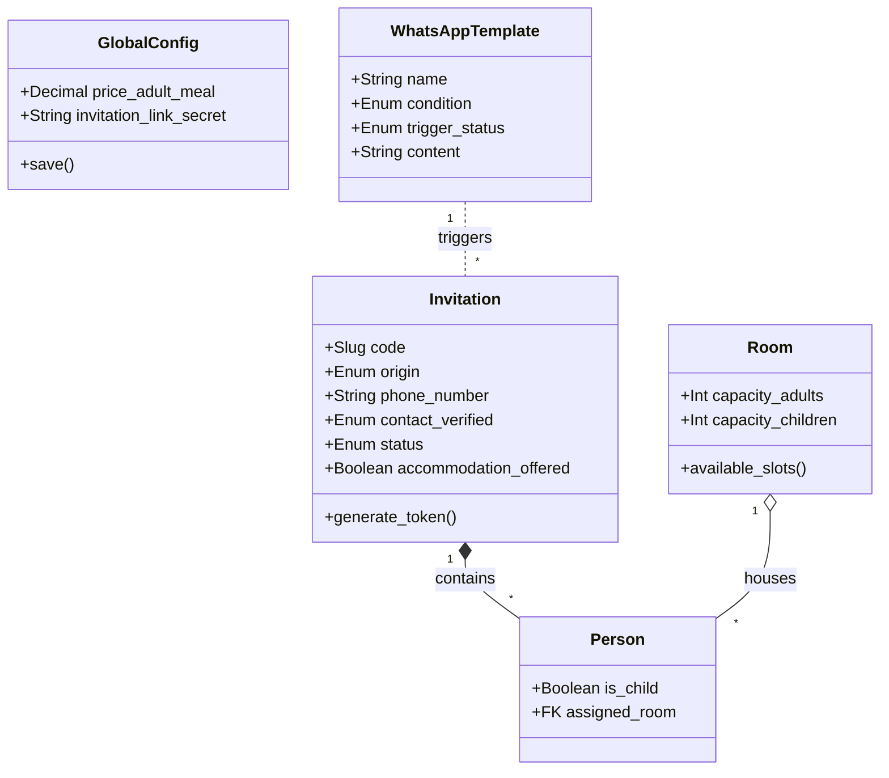

# Backend Core (Models & Logic)

Questa sezione analizza in dettaglio la Business Logic del sistema, definita in `backend/core/models.py`.

## 1. Configurazione Globale (`GlobalConfig`)
Il sistema utilizza un modello Singleton per gestire i parametri "live" del matrimonio senza dover redeployare il codice.
- **Logica Singleton**: Override del metodo `save()` per impedire la creazione di più di un'istanza.
- **Parametri**:
    - `price_*`: Costi unitari per calcoli budget automatici.
    - `invitation_link_secret`: Salt per la generazione di token HMAC sicuri.
    - `letter_text`: Template modificabile per la lettera di benvenuto.

## 2. Gestione Inviti (`Invitation` & `Person`)
Il cuore del sistema.

### Modello `Invitation`
Raggruppa un nucleo familiare.
- **Codice Univoco (`code`)**: Slug utilizzato nell'URL pubblico. È la chiave di accesso principale.
- **Contatti & Origine**:
  - `origin`: Enum (`groom`/`bride`) fondamentale per organizzazione tavoli e statistiche.
  - `phone_number`: Numero per invio automatizzato inviti via WhatsApp.
  - `contact_verified`: Enum (`ok`, `not_valid`, `not_exist`, `not_present`) che indica lo stato di verifica del numero su WhatsApp.
- **Affinities**: Relazione molti-a-molti ricorsiva per indicare gruppi amici (usato dall'algoritmo di assegnazione stanze).
- **Workflow Status**:
  Gestisce il ciclo di vita dell'invito:
  1. `created`: Inserito a sistema.
  2. `sent`: Messaggio inviato agli ospiti.
  3. `read`: Gli ospiti hanno visualizzato la pagina (pixel tracking).
  4. `confirmed` / `declined`: Scelta finale.
- **Flags Logistici**:
    - `accommodation_offered`: Se True, sblocca il form "Richiesta Alloggio" nel frontend.
    - `transfer_offered`: Se True, sblocca la selezione "Navetta".
- **Token HMAC**: Il metodo `generate_verification_token` crea una firma crittografica basata su `code + id + secret_key` per validare le richieste API pubbliche e prevenire ID enumeration.

### Modello `Person`
Rappresenta il singolo ospite.
- `is_child`: Booleano critico per:
    - Calcolo posti letto (Bambini < Adulti).
    - Calcolo costi pasti (Menu ridotto).
- `assigned_room`: FK verso `Room`, permette un'assegnazione granulare degli ospiti alle stanze disponibili.

## 3. Automazione e Workflow (Signals)

Il sistema implementa logiche reattive tramite Django Signals (`backend/core/signals.py`).

### Verifica Contatto WhatsApp (`Invitation.contact_verified`)
Quando un numero viene creato o modificato, o lo stato viene resettato manualmente a `not_valid`:
1.  Il signal `post_save` intercetta il cambio.
2.  Lancia il task sincrono `verify_whatsapp_contact_task` (in `utils.py`).
3.  Il task chiama il microservizio `whatsapp-integration` (`GET /api/contacts`) che verifica:
    - Esistenza del numero su WhatsApp.
    - Presenza del numero nella rubrica della sessione (Sposo/Sposa).
4.  Lo stato `contact_verified` viene aggiornato con il risultato (`ok`, `not_exist`, `not_present`).

### Trigger Cambio Stato (`Invitation.status`)
Quando lo stato di un invito cambia (es. da `sent` a `read` o da `read` a `confirmed`), il sistema:
1.  Verifica se esiste un `WhatsAppTemplate` attivo con `condition='status_change'` e `trigger_status` corrispondente al nuovo stato.
2.  Se esiste, genera un messaggio personalizzato sostituendo i placeholder:
    - `{name}`: Nome invito (es. Famiglia Rossi)
    - `{code}`: Codice invito
    - `{link}`: Link pubblico autologin
    - `{guest_names}`: Lista nomi ospiti
3.  Accoda il messaggio in `WhatsAppMessageQueue` per l'invio asincrono.

### Auto-Mark as Read
Quando viene registrata la prima analytics di tipo `visit` su un invito in stato `sent`:
- L'API `PublicLogInteractionView` aggiorna automaticamente lo stato a `read`.
- Questo triggera a cascata il signal di cui sopra (se configurato un template per lo stato `read`).

## 4. Gestione Alloggi (`Accommodation` & `Room`)
Sistema gerarchico per la gestione ospitalità.

### Logica "Available Slots"
Il modello `Room` implementa una logica smart per il calcolo della disponibilità (`available_slots()`):
1.  Conta gli occupanti attuali (Adulti e Bambini).
2.  I bambini occupano prioritariamente i posti "bambino" (`capacity_children`).
3.  Se i posti bambino sono esauriti, i bambini "traboccano" sui posti adulto.
4.  Restituisce un dizionario con posti liberi distinti per tipo.

### Algoritmo Assegnazione Automatica (Arena delle Strategie)
Il sistema implementa una **Arena Multi-Strategia** per l'assegnazione ottimale degli ospiti.
L'endpoint `/auto-assign` può essere chiamato in due modalità:
1. **SIMULATION**: Esegue in parallelo (in transazioni safe-rollback) diverse strategie e restituisce un report comparativo (spazio sprecato, % copertura).
2. **EXECUTION**: Applica la strategia scelta e committa le modifiche al DB.

#### Le Strategie Disponibili
1. **STANDARD**: Priorità Affinità, Stanze Grandi prima. (Classico).
2. **SPACE_OPTIMIZER**: (Tetris) Inviti Grandi prima, Stanze Piccole (Best Fit).
3. **CHILDREN_FIRST**: Priorità Inviti con bambini, Stanze con letti bambino.
4. **PERFECT_MATCH**: Cerca solo incastri perfetti (Capienza == Ospiti).
5. **SMALLEST_FIRST**: Inviti Piccoli prima, Stanze Piccole prima.
6. **AFFINITY_CLUSTER**: Tratta i gruppi affini come blocchi monolitici.

#### Regole Inviolabili (Tutte le strategie)
1. **Regola 1 (Isolamento)**: Una stanza può contenere SOLO persone dello stesso invito.
2. **Regola 2 (Compatibilità)**: Una struttura non può ospitare inviti tra loro "non affini".
3. **Regola 3 (Atomicità)**: Tutte le persone di un invito devono trovare posto nella stessa struttura (in una o più stanze), altrimenti l'intero invito non viene assegnato (Rollback).
4. **Regola 4 (Slot)**: Adulti solo in slot adulti; Bambini in slot bambini o adulti.

> **⚠️ NOTA TECNICA IMPORTANTE (Prefetch vs Live Query)**
> L'algoritmo utilizza `prefetch_related` per efficienza, MA per il controllo dell'owner della stanza (`get_room_owner`) è **OBBLIGATORIO** eseguire una query "live" sul database (`Person.objects.filter(...)`).
> Usare i dati prefetched (`room.assigned_guests.all()`) causerebbe letture "stale" (vecchie) all'interno della stessa transazione, portando alla violazione della Regola 1 (più inviti nella stessa stanza).

## 5. Analytics (`GuestInteraction` & `GuestHeatmap`)
Sistema di tracciamento integrato.
- **GuestInteraction**: Traccia eventi discreti (Visit, RSVP Submit, Click). Include metadata (IP anonimizzato, Device Type).
- **GuestHeatmap**: Raccoglie stream di coordinate (X,Y) per generare mappe di calore dell'attenzione utente sul frontend.

## Diagramma Classi Core

