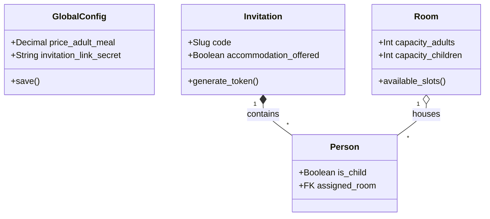

# Backend Core (Models & Logic)

Questa sezione analizza in dettaglio la Business Logic del sistema, definita in `backend/core/models.py`.

## 1. Configurazione Globale (`GlobalConfig`)
Il sistema utilizza un modello Singleton per gestire i parametri "live" del matrimonio senza dover redeployare il codice.
- **Logica Singleton**: Override del metodo `save()` per impedire la creazione di più di un'istanza.
- **Parametri**:
    - `price_*`: Costi unitari per calcoli budget automatici.
    - `invitation_link_secret`: Salt per la generazione di token HMAC sicuri.
    - `letter_text`: Template modificabile per la lettera di benvenuto.

## 2. Gestione Inviti (`Invitation` & `Person`)
Il cuore del sistema.

### Modello `Invitation`
Raggruppa un nucleo familiare.
- **Codice Univoco (`code`)**: Slug utilizzato nell'URL pubblico. È la chiave di accesso principale.
- **Flags Logistici**:
    - `accommodation_offered`: Se True, sblocca il form "Richiesta Alloggio" nel frontend.
    - `transfer_offered`: Se True, sblocca la selezione "Navetta".
- **Token HMAC**: Il metodo `generate_verification_token` crea una firma crittografica basata su `code + id + secret_key` per validare le richieste API pubbliche e prevenire ID enumeration.

### Modello `Person`
Rappresenta il singolo ospite.
- `is_child`: Booleano critico per:
    - Calcolo posti letto (Bambini < Adulti).
    - Calcolo costi pasti (Menu ridotto).
- `assigned_room`: FK verso `Room`, permette un'assegnazione granulare degli ospiti alle stanze disponibili.

## 3. Gestione Alloggi (`Accommodation` & `Room`)
Sistema gerarchico per la gestione ospitalità.

### Logica "Available Slots"
Il modello `Room` implementa una logica smart per il calcolo della disponibilità (`available_slots()`):
1.  Conta gli occupanti attuali (Adulti e Bambini).
2.  I bambini occupano prioritariamente i posti "bambino" (`capacity_children`).
3.  Se i posti bambino sono esauriti, i bambini "traboccano" sui posti adulto.
4.  Restituisce un dizionario con posti liberi distinti per tipo.

## 4. Analytics (`GuestInteraction` & `GuestHeatmap`)
Sistema di tracciamento integrato.
- **GuestInteraction**: Traccia eventi discreti (Visit, RSVP Submit, Click). Include metadata (IP anonimizzato, Device Type).
- **GuestHeatmap**: Raccoglie stream di coordinate (X,Y) per generare mappe di calore dell'attenzione utente sul frontend.

## Diagramma Classi Core

