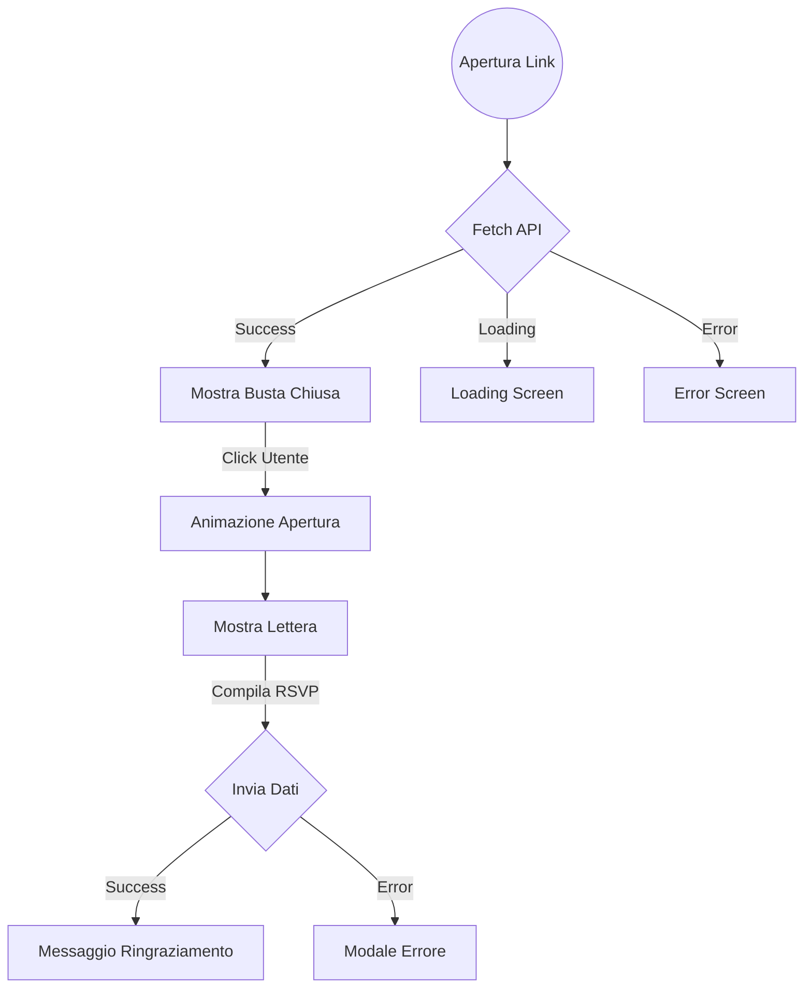

# Frontend User Components

Questa sezione analizza i componenti principali del frontend pubblico (`frontend-user`), focalizzandosi su struttura, interattività e integrazione API.

## 1. Struttura Applicativa
L'applicazione è una Single Page Application (SPA) costruita con React 19.
- **Entry Point**: `src/main.jsx`
- **Root Component**: `src/App.jsx`
- **Routing**: Gestito internamente (o tramite semplice conditional rendering in base allo stato).
- **Internationalization (i18n)**: Supporto nativo IT/EN tramite `react-i18next`.

## 2. Componenti Core (`src/components/`)

### EnvelopeAnimation (`EnvelopeAnimation.jsx`)
Il componente "Wow Effect" iniziale. Simula l'apertura fisica di una busta da lettera.
- **Tecnologia**: CSS3 Animations + React State.
- **Stati**: `closed` → `opening` → `open`.
- **Interazione**: Al click/tap, innesca la transizione che rivela il contenuto (`LetterContent`).
- **Testi Dinamici**: Utilizza `useConfigurableText` per mostrare un messaggio di benvenuto personalizzato sul fronte della busta.

### LetterContent (`LetterContent.jsx`)
Il corpo principale dell'invito.
- **Visualizzazione**: Renderizza i contenuti dinamici (CMS) per ogni sezione (Alloggio, Viaggio, Evento, ecc.).
- **Logica Condizionale**: Renderizza le sezioni RSVP, Accommodation e Transfer solo se i flag `*_offered` nel payload API sono `true`.
- **Form Gestione**: Include i controlli per accettare/declinare e specificare note/allergie, completamente localizzati (i18n).
- **Integrazione CMS**: Recupera i testi configurati nell'admin panel tramite `TextContext`.

**Nuova Feature: Dietary Requirements (Wizard Step 2)**
- **Intolleranze**: Aggiunto campo testuale per ogni ospite per specificare allergie.
- **Badge**: Visualizzazione immediata di un warning (⚠️) accanto al nome dell'ospite nella lista.
- **Integrazione**: Dati salvati nel payload RSVP e visibili lato admin.

### ErrorModal (`ErrorModal.jsx`)
Sistema centralizzato per la gestione degli errori.
- **Utilizzo**: Invocato automaticamente via `useApiErrorModal` hook quando una chiamata API fallisce.
- **UX**: Impedisce il "silenzio" degli errori, mostrando feedback chiaro e localizzato all'utente (es. "Codice invito non valido").

### LanguageSwitcher (`LanguageSwitcher.jsx`)
Componente UI per il cambio lingua.
- **Persistenza**: Salva la preferenza utente in `localStorage`.
- **Posizione**: Integrato nell'header/footer o accessibile globalmente.

## 3. Gestione Stato & Hooks (`src/hooks/`)

### `useApiErrorModal.js`
Custom hook per intercettare errori API e pilotare il modale.
- **Pattern**: Wrappa le chiamate `fetch` o intercetta le promise rejection.
- **Vantaggio**: Decoppia la logica di errore dai componenti UI.

### `useConfigurableText` (via `TextContext`)
Hook per accedere ai testi dinamici in qualsiasi punto dell'app.
- **Fallback**: Restituisce un valore di default se la chiave non è configurata o le API non rispondono.
- **Loading State**: Gestisce lo stato di caricamento dei testi.

## 4. Servizi API (`src/services/`)

### `api.js`
Client HTTP tipizzato (wrapper su `fetch`).
- **Config**: Legge `REACT_APP_API_URL` da `.env`.
- **Endpoints**:
    - `getInvitation(code)`: Recupera i dati iniziali.
    - `submitRSVP(code, data)`: Invia le conferme (con gestione token).

### `textConfig.js`
Servizio dedicato al recupero dei testi CMS.
- **Endpoints**: `getConfigurableTexts()` (chiama `/api/public/texts/`).

### `analytics.js`
Modulo per il tracking granulare.
- **Funzioni**: `trackVisit`, `trackClick`, `trackMouse`.
- **Debounce**: Implementa logica per non inondare il backend di eventi mousemove (invio a batch o throttled).

## 5. Gestione Asset Grafici

L'applicazione segue uno standard rigoroso per la gestione delle immagini e delle icone per garantire performance e manutenibilità.

### Struttura Directory
- `src/assets/icons/`: Icone UI riutilizzabili (es. `react-logo.svg`, `x.svg`, `chevron-down.svg`).
- `src/assets/illustrations/`: Illustrazioni complesse (es. `sad-face.svg` per messaggi di errore).
- `public/`: Asset statici serviti direttamente (es. `vite.svg`, favicon) che non richiedono bundling.

### Standard di Implementazione
1. **Icone UI**: Utilizzare `lucide-react` per la maggior parte delle icone (es. `<X />`, `<ChevronDown />`).
2. **Import SVG**: Per file custom, importare l'URL o il componente React:
   ```javascript
   // Metodo Immagine (Preferito per illustrazioni complesse)
   import sadFaceUrl from '../../assets/illustrations/sad-face.svg';
   
   ```
3. **Vietato**: Non inserire SVG inline (`<svg>...</svg>`) direttamente nel codice JSX dei componenti.

## 6. Pagine (`src/pages/`)

### `InvitationPage.jsx`
Il contenitore logico principale.
1.  Estrae il `code` dall'URL (slug).
2.  Chiama `api.getInvitation(code)`.
3.  In parallelo, il `TextContext` carica i testi dinamici.
4.  Gestisce gli stati di caricamento (`LoadingScreen`) ed errore (`ErrorScreen`).
5.  Se successo, monta `EnvelopeAnimation` passando i dati ricevuti.

## Diagramma Flusso UI


